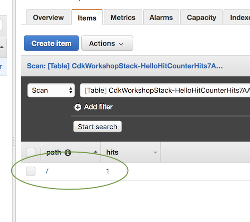

+++
title = "Otorgando permisos"
weight = 600
+++

## Permita que Lambda lea/escriba nuestra tabla de DynamoDB

Démosle permisos al rol de ejecución de Lambda para leer/escribir desde nuestra tabla.

Regrese a `hitcounter.go` y agregue la siguiente línea resaltada:


package hitcounter

import (
  "github.com/aws/aws-cdk-go/awscdk/v2/awsdynamodb"
  "github.com/aws/aws-cdk-go/awscdk/v2/awslambda"
  "github.com/aws/constructs-go/constructs/v10"
  "github.com/aws/jsii-runtime-go"
)

type HitCounterProps struct {
  Downstream awslambda.IFunction
}

type hitCounter struct {
  constructs.Construct
  handler awslambda.IFunction
}

type HitCounter interface {
  constructs.Construct
  Handler() awslambda.IFunction
}

func NewHitCounter(scope constructs.Construct, id string, props *HitCounterProps) HitCounter {
  this := constructs.NewConstruct(scope, &id)

  table := awsdynamodb.NewTable(this, jsii.String("Hits"), &awsdynamodb.TableProps{
    PartitionKey: &awsdynamodb.Attribute{Name: jsii.String("path"), Type: awsdynamodb.AttributeType_STRING},
  })

  handler := awslambda.NewFunction(this, jsii.String("HitCounterHandler"), &awslambda.FunctionProps{
    Runtime: awslambda.Runtime_NODEJS_16_X(),
    Handler: jsii.String("hitcounter.handler"),
    Code:    awslambda.Code_FromAsset(jsii.String("lambda"), nil),
    Environment: &map[string]*string{
      "DOWNSTREAM_FUNCTION_NAME": props.Downstream.FunctionName(),
      "HITS_TABLE_NAME":          table.TableName(),
    },
  })

  table.GrantReadWriteData(handler)

  return &hitCounter{this, handler}
}

func (h *hitCounter) Handler() awslambda.IFunction {
  return h.handler
}


## Deploy

Guarda y deploy: 

```
cdk deploy
```

## Prueba de nuevo

Bien, la implementación está completa. Ejecutemos nuestra prueba nuevamente (ya sea usando `curl` o su navegador web):

```
curl -i https://xxxxxxxxxx.execute-api.us-east-1.amazonaws.com/prod/
```

¿De nuevo?

```
HTTP/2 502 Bad Gateway
...

{"message": "Internal server error"}
```

# 😢

¡Seguimos recibiendo este molesto error 5xx! Veamos nuestros registros de CloudWatch nuevamente (haga clic en "Refresh"):

```json
{
    "errorMessage": "User: arn:aws:sts::585695036304:assumed-role/CdkWorkshopStack-HelloHitCounterHitCounterHandlerS-TU5M09L1UBID/CdkWorkshopStack-HelloHitCounterHitCounterHandlerD-144HVUNEWRWEO is not authorized to perform: lambda:InvokeFunction on resource: arn:aws:lambda:us-east-1:585695036304:function:CdkWorkshopStack-HelloHandler2E4FBA4D-149MVAO4969O7",
    "errorType": "AccessDeniedException",
    "stackTrace": [
        "Object.extractError (/var/runtime/node_modules/aws-sdk/lib/protocol/json.js:48:27)",
        "Request.extractError (/var/runtime/node_modules/aws-sdk/lib/protocol/rest_json.js:52:8)",
        "Request.callListeners (/var/runtime/node_modules/aws-sdk/lib/sequential_executor.js:105:20)",
        "Request.emit (/var/runtime/node_modules/aws-sdk/lib/sequential_executor.js:77:10)",
        "Request.emit (/var/runtime/node_modules/aws-sdk/lib/request.js:683:14)",
        "Request.transition (/var/runtime/node_modules/aws-sdk/lib/request.js:22:10)",
        "AcceptorStateMachine.runTo (/var/runtime/node_modules/aws-sdk/lib/state_machine.js:14:12)",
        "/var/runtime/node_modules/aws-sdk/lib/state_machine.js:26:10",
        "Request.<anonymous> (/var/runtime/node_modules/aws-sdk/lib/request.js:38:9)",
        "Request.<anonymous> (/var/runtime/node_modules/aws-sdk/lib/request.js:685:12)"
    ]
}
```

Otro acceso denegado, pero esta vez, si miras de cerca:

```
User: <VERY-LONG-STRING> is not authorized to perform: lambda:InvokeFunction on resource: <VERY-LONG-STRING>"
```

Así que parece que nuestro contador de solicitudes logró escribir en la base de datos. Podemos confirmar yendo a la consola de [DynamoDB Console](https://console.aws.amazon.com/dynamodb/home):



Pero también debemos otorgar permisos a nuestro contador de visitas para solicitudes la función lambda downstream.

## Otorgar permisos de invocación

Agregue las líneas resaltadas a `hitcounter.go`:


package hitcounter

import (
  "github.com/aws/aws-cdk-go/awscdk/v2/awsdynamodb"
  "github.com/aws/aws-cdk-go/awscdk/v2/awslambda"
  "github.com/aws/constructs-go/constructs/v10"
  "github.com/aws/jsii-runtime-go"
)

type HitCounterProps struct {
  Downstream awslambda.IFunction
}

type hitCounter struct {
  constructs.Construct
  handler awslambda.IFunction
}

type HitCounter interface {
  constructs.Construct
  Handler() awslambda.IFunction
}

func NewHitCounter(scope constructs.Construct, id string, props *HitCounterProps) HitCounter {
  this := constructs.NewConstruct(scope, &id)

  table := awsdynamodb.NewTable(this, jsii.String("Hits"), &awsdynamodb.TableProps{
    PartitionKey: &awsdynamodb.Attribute{Name: jsii.String("path"), Type: awsdynamodb.AttributeType_STRING},
  })

  handler := awslambda.NewFunction(this, jsii.String("HitCounterHandler"), &awslambda.FunctionProps{
    Runtime: awslambda.Runtime_NODEJS_16_X(),
    Handler: jsii.String("hitcounter.handler"),
    Code:    awslambda.Code_FromAsset(jsii.String("lambda"), nil),
    Environment: &map[string]*string{
      "DOWNSTREAM_FUNCTION_NAME": props.Downstream.FunctionName(),
      "HITS_TABLE_NAME":          table.TableName(),
    },
  })

  table.GrantReadWriteData(handler)

  props.Downstream.GrantInvoke(handler)

  return &hitCounter{this, handler}
}

func (h *hitCounter) Handler() awslambda.IFunction {
  return h.handler
}


## Diff

Puede verificar lo que esto hizo usando `cdk diff`:

```
cdk diff
```

La sección de **Resources** debería tener un aspecto similar a estO, que muestra que la declaración de IAM se agregó al rol:

```
Resources
[~] AWS::IAM::Policy HelloHitCounter/HitCounterHandler/ServiceRole/DefaultPolicy HelloHitCounterHitCounterHandlerServiceRoleDefaultPolicy1487A60A
 └─ [~] PolicyDocument
     └─ [~] .Statement:
         └─ @@ -19,5 +19,15 @@
            [ ]         "Arn"
            [ ]       ]
            [ ]     }
            [+]   },
            [+]   {
            [+]     "Action": "lambda:InvokeFunction",
            [+]     "Effect": "Allow",
            [+]     "Resource": {
            [+]       "Fn::GetAtt": [
            [+]         "HelloHandler2E4FBA4D",
            [+]         "Arn"
            [+]       ]
            [+]     }
            [ ]   }
            [ ] ]
```

Que es exactamente lo que queríamos.

## Deploy

Bien... démosle otra oportunidad:

```
cdk deploy
```

Luego acceda a su punto de enlace con `curl` o con su navegador web:

```
curl -i https://xxxxxxxxxx.execute-api.us-east-1.amazonaws.com/prod/
```

La salida debería verse así:

```
HTTP/2 200 OK
...

Hello, CDK! You've hit /
```

> Si aún obtiene 5xx, espere unos segundos e intente nuevamente. A veces, API Gateway tarda un poco en "voltear" el punto final para usar la nueva implementación.


# 😲
