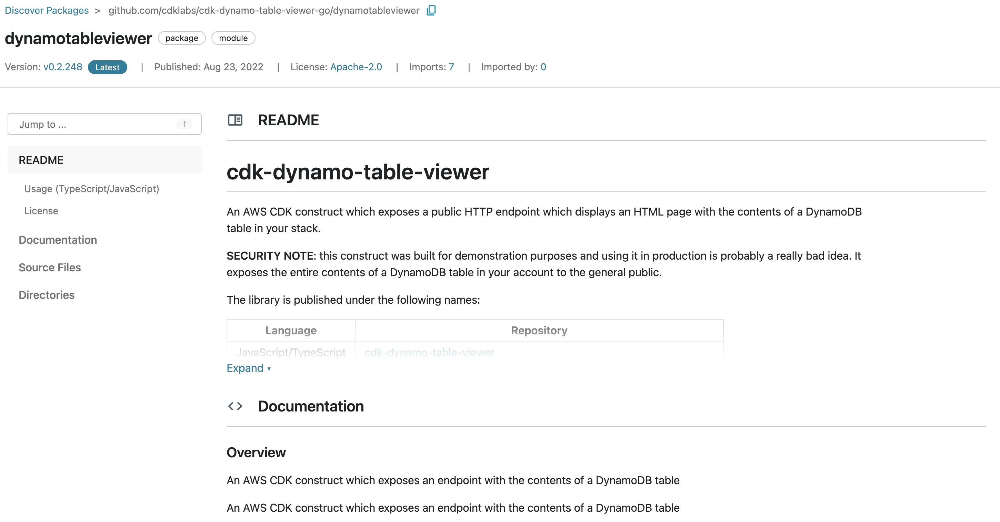

+++
title = "Aprendiendo sobre el constructo Table Viewer"
weight = 100
+++

## Leyendo la documentación

Navegaremos hacia [la página de cdk-dynamo-table-viewer](https://pkg.go.dev/github.com/cdklabs/cdk-dynamo-table-viewer-go/dynamotableviewer) en pkg.go.dev para leer la documentación del módulo.

{}
Como menciona el README de esta librería, no está pensada para uso productivo. Principalmente 
porque expondrá contenido de la tabla de DynamoDB a cualquiera, sin autenticación.
{}

