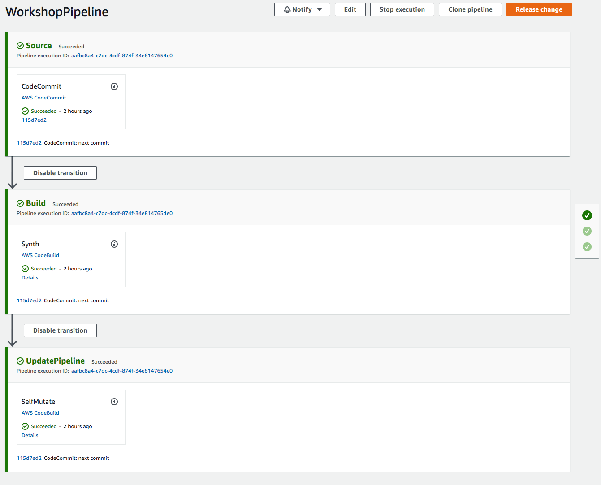

+++
title = "Crear una Nueva Canalización"
weight = 3000
+++

## Definir una Canalización Vacía
Ahora estamos listos para definir las bases de la canalización.

Edite el archivo `infra/pipeline-stack.go` así:


package infra

import (
	"github.com/aws/aws-cdk-go/awscdk/v2"
	"github.com/aws/aws-cdk-go/awscdk/v2/awscodecommit"
	"github.com/aws/aws-cdk-go/awscdk/v2/pipelines"
	"github.com/aws/constructs-go/constructs/v10"
	"github.com/aws/jsii-runtime-go"
)

type PipelineStackProps struct {
	awscdk.StackProps
}

func NewPipelineStack(scope constructs.Construct, id string, props *PipelineStackProps) awscdk.Stack {
	var sprops awscdk.StackProps
	if props != nil {
		sprops = props.StackProps
	}
	stack := awscdk.NewStack(scope, &id, &sprops)

	repo := awscodecommit.NewRepository(stack, jsii.String("WorkshopRepo"), &awscodecommit.RepositoryProps{
		RepositoryName: jsii.String("WorkshopRepo"),
	})

	pipelines.NewCodePipeline(stack, jsii.String("Pipeline"), &pipelines.CodePipelineProps{
		PipelineName: jsii.String("WorkshopPipeline"),
		Synth: pipelines.NewCodeBuildStep(jsii.String("SynthStep"), &pipelines.CodeBuildStepProps{
			Input: pipelines.CodePipelineSource_CodeCommit(repo, jsii.String("main"), nil),
			Commands: jsii.Strings(
				"npm install -g aws-cdk",
                "goenv install 1.18.3",
				"goenv local 1.18.3",
				"npx cdk synth",
			),
		}),
	})

	return stack
}


### Descripción de los Componentes
El código anterior hace diferentes cosas:

* `NewCodePipeline(...)`: Esto inicializa la canalización con los valores requeridos. Esto servirá como el componente base de aquí en adelante. Cada canalización requiere como mínimo:
    * `Synth(...)`: El `synsynthActionth` de la canalización describe los comandos necesarios para instalar dependencias, construir, y sintetizar la aplicación CDK desde el código fuente. Esto siempre debe terminar en un comando *synth*, para proyectos basados en NPM esto siempre es `npx cdk synth`.
  * El `Input` del paso synth especifica el repositorio donde el codigo fuente de CDK está almacenado.

## Desplegar la Canalización y Ver el Resultado
Todo lo que falta para poner en marcha nuestra canalización es confirmar nuestros cambios y hacer el despliegue una última vez.

```
git commit -am "MESSAGE" && git push
npx cdk deploy
```

CdkPipelines actualiza automáticamente cada vez que se hace una confirmación a un repositorio, así que esta es la *última vez* que necesitaremos ejecutar este comando!

Una vez que el despliegue haya finalizado, usted puede ir a la [consola de CodePipeline](https://console.aws.amazon.com/codesuite/codepipeline/pipelines) y allí podrá ver una nueva canalización! Si lo hace, debería ver algo así:


