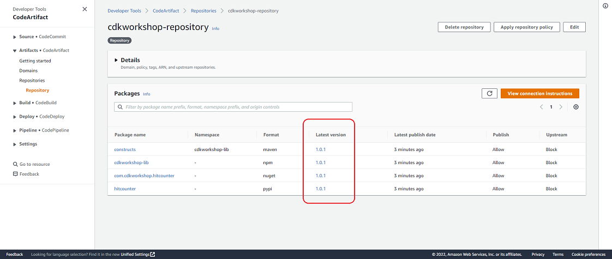
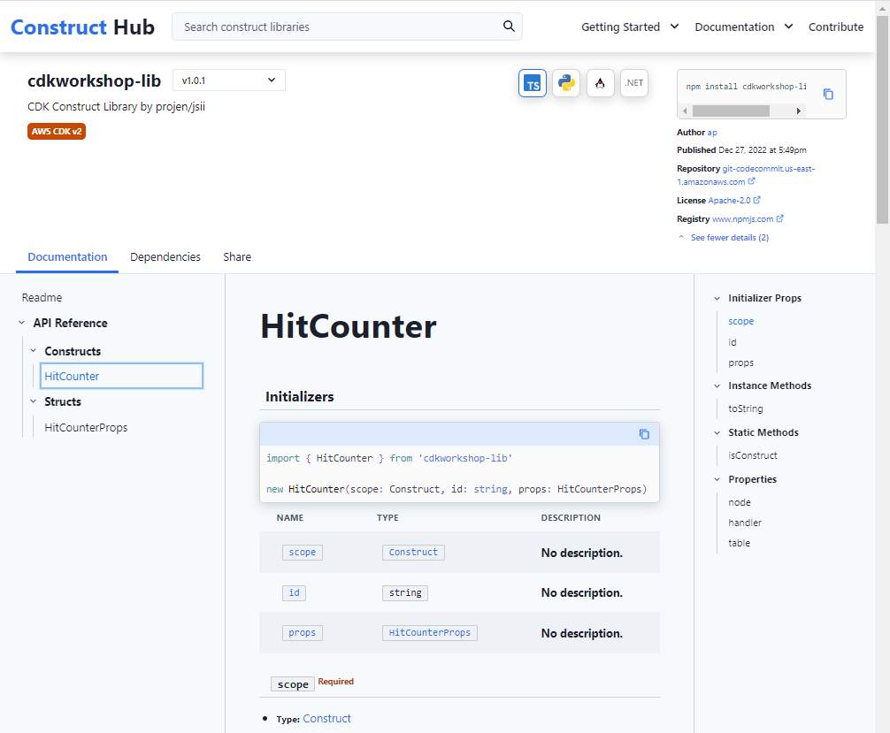

+++
title = "Crear la Canalización y Publicar el Constructo"
weight = 500
+++

## Desplegar la Canalización

{}
Antes de continuar, asegurese que InternalConstructHubStack tiene el estado CREATE_COMPLETE en la consola de <a href="https://console.aws.amazon.com/cloudformation" target="_blank">CloudFormation</a>.
{}

Hasta este punto hemos creado el código del constructo en el directorio `constructs/` y el código de la canalización en el directorio `pipeline/`.  Ahora haremos el despliege desde el directorio `pipeline/`:


cdk deploy


## Publicar el Artefacto

`cdk deploy` crea la canalización y publica los artefactos.

Una vez que `cdk deploy` haya terminado, vaya a <a href="https://console.aws.amazon.com/codesuite/codepipeline/pipelines" target="_blank">CodePipeline</a> y verifique la ejecución de la canalización.  Una vez que haya finalizado la ejecución de la canalización, navegue a <a href="https://console.aws.amazon.com/codesuite/codeartifact/repositories" target="_blank">CodeArtifact</a>, haga click en `cdkworkshop-repository`, y observe que la versión `1.0.0` ha sido publicada.

Si esperamos unos ~5-10 minutos más, veremos que algunos de los paquetes fueron actualizados a la versión `0.0.0`. Pero porqué ocurre esto? Esto sucede porque Projen hizo otra confirmación al repositorio y esto activó CodePipeline. Podemos verificar esto yendo a `Repositories > Commits` en la consola de CodeCommit. Allí usted pueder ver que la primera confirmación (commit) es suya mientras que la segunda es de "CodeBuild Automation". Según la <a href="https://projen.io/releases.html#initial-development-phase" target="_blank">Documentación de Projen</a>, los proyectos nuevos comienzan con la versión `0.0.0`. Debido al hecho que la confirmación de Projen se envió después de la nuestra, la versión fué inicialmente asignada a `1.0.0` y después a `0.0.0`.  Esto solamente sucederá en la primera confirmación y es específico a Projen. Confirmaciones posteriores seguirán las convenciones estándar para los números de version. 

## Combinar Ramas Diferentes
Antes de continuar es importante mencionar debido a que Projen hace sus propias confirmaciones al repositorio de CodeCommit, el repositorio remoto `construct-lib-repo` y el repositorio local `construct-lib-repo` estarán fuera de sincronización. Para arreglar esto, asegurese de ejecutar `git pull` desde su directorio `construct-lib-repo` local antes enviar cualquier cambio al repositorio remoto:


git pull


## Versiones Principales, Secundarias y Correcciones
Projen utiliza <a href="https://www.conventionalcommits.org/en/v1.0.0/#specification" target="_blank">Conventional Commits</a> para inferir nuevas versiones de artefactos. El mensaje de confirmación define como el número de versión debe ser incrementado, es decir, si esta es una version principal, secundaria o corrección.

Hagamos una pequeña "corrección" al código de nuestra biblioteca de constructos y confirmemos el cambio a CodeCommit.  Abra el archivo `constructs/lambda/hitcounter.js` y modifique el mensaje de _log_ así:


console.log('downstream function response:', JSON.stringify(resp, undefined, 2));


El código debe verse así:


const { DynamoDB, Lambda } = require('aws-sdk');

exports.handler = async function(event) {
  console.log("request:", JSON.stringify(event, undefined, 2));

  // create AWS SDK clients
  const dynamo = new DynamoDB();
  const lambda = new Lambda();

  // update dynamo entry for "path" with hits++
  await dynamo.updateItem({
    TableName: process.env.HITS_TABLE_NAME,
    Key: { path: { S: event.path } },
    UpdateExpression: 'ADD hits :incr',
    ExpressionAttributeValues: { ':incr': { N: '1' } }
  }).promise();

  // call downstream function and capture response
  const resp = await lambda.invoke({
    FunctionName: process.env.DOWNSTREAM_FUNCTION_NAME,
    Payload: JSON.stringify(event)
  }).promise();

  console.log('downstream function response:', JSON.stringify(resp, undefined, 2));

  // return response back to upstream caller
  return JSON.parse(resp.Payload);
};


Confirme los cambios a CodeCommit desde el directorio `construct-lib-repo`:


git add .
git commit -m 'fix: modified log message'
git push


Ahora cuando la canalización corra, debería publicar un artefacto actualizado solamente en la última parte (Patch).  Navegue a <a href="https://console.aws.amazon.com/codesuite/codeartifact/repositories" target="_blank">CodeArtifact</a> y observe que tiene la versión `1.0.1` del artefacto.

## Observer los Artefactos en el Construct Hub Interno

El la consola de <a href="https://console.aws.amazon.com/cloudformation" target="_blank">CloudFormation</a>, navegue al tab Outputs de `InternalConstructHubStack`. Deslicese en la columna `Export name` hasta `ConstructHubDomainName`. Haga click en el URL del dominio (en la columna `Value`) de esa línea para el el valor del _front-end_ del Construct Hub Interno.  Haga click en el botón `Find constructs` para ver los constructos publicados.

Seleccione `cdkworkshop-lib > HitCounter` para mostrar los detalles del constructo publicado.

## Resumen

En esta sección, creamos la instancia de la canalización desde el código de la canalización de CDK.  Observamos que la canalización compiló, transpiló, empaquetó y publicó los artefactos a nuestro Construct Hub Interno.  A continuación veremos como consumir los artefactos transpilados desde nuestro Construct Hub Interno.
